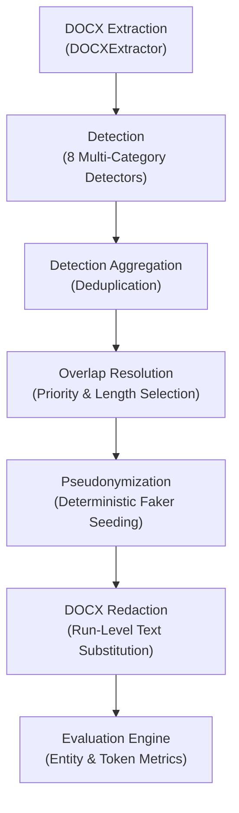

# PII Redaction Tool

An industrial-grade, privacy-preserving Microsoft Word (`.docx`) document redaction and evaluation engine. Built to process complex Indian corporate prospectuses, detect 9 categories of Personally Identifiable Information (PII), deterministically pseudonymize sensitive entities with fake data, apply run-level XML text substitution while preserving styles and tables, and perform quantitative evaluation against a provisional automated annotation benchmark (no candidates were independently human-reviewed).

---

## Problem Statement

Financial prospectuses (e.g., Red Herring Prospectuses filed with regulatory bodies) contain extensive sensitive data—including executive personal names, contact numbers, email addresses, registered company offices, and institutional banking details—alongside public financial metrics, share allocations, and legal clauses.

Traditional manual redaction or basic search-and-replace tools suffer from three major vulnerabilities:
1. **Document Corruption**: Flattening open XML text strips paragraph formatting, table styling, and run properties.
2. **False Positives**: Naive rules misclassify financial figures, page numbers, incorporation dates, and tax codes as PII.
3. **Inconsistent Pseudonymization**: Replacing recurring names with random fake data breaks document co-reference and legal readability.

The **PII Redaction Tool** solves these challenges by combining a hybrid NLP/Regex detection pipeline, run-level DOCX substitution, deterministic pseudonym mapping, and token-level evaluation metrics.

---

## Input Document

* **Primary Input Scope**: Microsoft Word (`.docx`) financial prospectus documents (e.g. `Red Herring Prospectus.docx`).
* **Document Characteristics** (Benchmark Target):
  * **Top-Level Paragraphs**: 1,006 `w:p` elements
  * **Table Cell Paragraphs**: 4,199 `w:p` elements across 76 tables (3,722 cells)
  * **Total Extracted Characters**: 441,075 characters (~69,746 tokens)
  * **Active Headers**: 73 header XML files containing text

> **Note**: The original source prospectus document (`input/Red Herring Prospectus.docx`) and raw evaluation annotation datasets (`evaluation/ground_truth.json`, `evaluation/ground_truth_verified.json`, etc.) are intentionally excluded from the public repository to prevent exposing raw PII and sensitive candidate strings. Users can process any target `.docx` file by placing it in `input/` or specifying `--input path/to/document.docx`.

---

## Supported PII Types

The pipeline natively supports 9 PII categories:

| PII Category | Description & Inclusion Scope | Format / Logic |
| :--- | :--- | :--- |
| **`PERSON`** | Names of natural persons (directors, promoters, officers) | Local spaCy NER + Title/Honorific rules |
| **`EMAIL`** | Personal and corporate contact email addresses | Compiled regex (`local@domain.ext`) |
| **`PHONE`** | Indian mobile, landline, and formatted phone numbers | Compiled regex (`+91`, landline STD codes) |
| **`ORGANIZATION`** | Private corporate entity names (issuers, auditors, banks) | Local spaCy NER + Legal suffix matching |
| **`ADDRESS`** | Multi-component physical premises & mailing addresses | Multi-signal premises/locality/PIN scoring |
| **`SSN`** | US Social Security Numbers (`NNN-NN-NNNN`) | Area/Group/Serial structured regex |
| **`CREDIT_CARD`** | Financial credit/debit card numbers | 13–19 digit candidate extraction + Luhn checksum |
| **`DOB`** | Dates of birth of natural persons | Contextual prefix triggers (`DOB:`, `Born on`) |
| **`IP_ADDRESS`** | IPv4 network addresses (`192.168.1.1`) | Negative lookaround bounds + `ipaddress` validation |

---

## Architecture

The system enforces a strict 7-stage sequential architecture:



1. **DOCX Extraction**: Parses body paragraphs, table cells, headers, and footers while preserving exact XML element coordinates (`SourceLocation`).
2. **Detection**: Runs 8 specialized detection components in parallel over extracted text chunks.
3. **Detection Aggregation**: Normalizes detection metadata and removes exact duplicate spans.
4. **Overlap Resolution**: Resolves overlapping detection spans using a strict priority hierarchy (`EMAIL/PHONE/SSN/CC/IP > DOB > ADDRESS > ORGANIZATION > PERSON`) and span length.
5. **Pseudonymization**: Generates deterministic synthetic replacements using MD5 hash seeds per `(entity_type, text)` pair.
6. **DOCX Redaction**: Performs precise run-level XML substitution (`<w:r>`) without corrupting document styles, tables, or layout.
7. **Evaluation**: Compares predictions against a provisional automated annotation benchmark to report entity-level Micro-F1 and token-level accuracy. No candidates were independently human-reviewed; all metrics are provisional.

---

## Detection Approach

The system employs a multi-tiered hybrid detection methodology:
* **Compiled Regex**: Used for structured formats (`EMAIL`, `PHONE`, `SSN`, `IP_ADDRESS`, `CREDIT_CARD`) with negative lookaround assertions (`(?<![\d.])`) to prevent partial matches.
* **Local spaCy NER**: Loads `en_core_web_sm` locally (zero external network/API calls) for `PERSON` and `ORGANIZATION` entity extraction.
* **Contextual Trigger Rules**: `DOBDetector` requires explicit birth context triggers (`"Date of Birth:"`, `"DOB:"`, `"Born on"`) to prevent classifying corporate incorporation or filing dates as DOB.
* **Mathematical & Algorithmic Validation**:
  * `CreditCardDetector` validates 16-digit candidates against the Luhn checksum algorithm (`_validate_luhn`).
  * `IPDetector` validates candidate strings using Python's native `ipaddress.ip_address()` module.
  * `SSNDetector` validates area codes (`000`, `666`, `900-999` rejected) and group/serial numbers.

---

## Why a Hybrid Approach?

Regex alone is fundamentally insufficient for industrial PII redaction:
* **Names (`PERSON`)**: Person names lack uniform patterns. RegEx cannot distinguish between `"Rashi Patil"` (Person) and `"Red Herring"` (Title) without NLP context.
* **Organizations (`ORGANIZATION`)**: Corporate entities appear in varied contexts (*"KSH International Limited"*, *"ICICI Securities"*). RegEx rules generate thousands of false positives on capitalized document headers.
* **Addresses (`ADDRESS`)**: Physical addresses span multiple lines and contain mixed combinations of premises, locality, road names, and PIN codes.
* **Dates of Birth (`DOB`)**: RegEx date patterns match every date in a document (`"December 10, 2025"`, `"July 30, 1979"`). Only hybrid contextual analysis can filter out filing, incorporation, and agreement dates.

---

## DOCX Handling

To prevent document corruption during redaction:
* **Paragraphs & Tables**: Iterates directly over `doc.paragraphs` and `table.cell.paragraphs`, preserving paragraph alignments, line spacing, and table cell borders.
* **Run-Level Text Substitution**: DOCX stores formatted text inside runs (`<w:r>`). When a PII entity span crosses run boundaries:
  * *Single-Run Match*: Replaces the entity substring directly within `run.text`, preserving bold, italic, font size, and color attributes.
  * *Multi-Run Match*: Replaces the prefix in the first run, clears intermediate runs (`run.text = ""`), and retains the remaining text in the trailing run.

---

## Pseudonymization

Pseudonymization replaces sensitive PII with synthetic alternatives deterministically:
* **MD5 Seed Generation**: Computes an MD5 integer seed from `(entity_type, original_text.strip().lower())`.
* **Consistent Replacement**: If `"Rashi Patil"` appears 20 times in a document, all 20 occurrences are replaced by the exact same synthetic name (e.g. `"John Doe"`).
* **Domain Security Standards**:
  * `EMAIL`: Uses reserved documentation domain (`@example.com`).
  * `PHONE`: Uses synthetic Indian mobile format (`+91 99########`).
  * `IP_ADDRESS`: Uses RFC 5737 documentation test range (`192.0.2.x`).
  * `CREDIT_CARD`: Uses recognized test card pattern (`4000 xxxx xxxx xxxx`).
  * `SSN`: Uses synthetic test SSN pattern (`000-XX-XXXX`).

---

## Evaluation Methodology

Evaluation compares model predictions against ground truth annotations (see [`evaluation/review_workflow.md`](evaluation/review_workflow.md)):

> **⚠️ PROVISIONAL EVALUATION**: The benchmark ground truth contains **provisional candidate annotations** generated by automated rules, NOT genuine human-reviewed annotations. Raw annotation datasets are excluded from the public repository to protect source data confidentiality. See [`evaluation/review_workflow.md`](evaluation/review_workflow.md) and [`docs/GROUND_TRUTH_PROVENANCE.md`](docs/GROUND_TRUTH_PROVENANCE.md) for provenance details.

### 1. Entity-Level Matching (Precision, Recall, F1)
A prediction is a **True Positive (TP)** if and only if:
1. Predicted `entity_type` matches ground-truth `entity_type`.
2. The unique DOCX `source_location` (`source_type`, `table_index`, `row_index`, `cell_index`, `paragraph_index`, `header_index`, `footer_index`) matches.
3. Normalized character span `(start, end)` matches the ground-truth span.

$$\text{Precision} = \frac{\text{TP}}{\text{TP} + \text{FP}}, \quad \text{Recall} = \frac{\text{TP}}{\text{TP} + \text{FN}}, \quad \text{F1} = 2 \times \frac{\text{Precision} \times \text{Recall}}{\text{Precision} + \text{Recall}}$$

### 2. Token-Level Classification Accuracy
To calculate accuracy meaningfully without inventing arbitrary True Negative entity counts, the engine tokenizes document text into whitespace-delimited tokens (`69,746` total tokens):
* **Positive Class**: Tokens belonging to ground-truth PII entity spans.
* **Negative Class**: Tokens outside ground-truth PII entity spans.

$$\text{Accuracy}_{\text{token}} = \frac{\text{TP}_{\text{tokens}} + \text{TN}_{\text{tokens}}}{\text{Total Document Tokens}}$$

---

## Results

> **⚠️ PROVISIONAL EVALUATION NOTICE**: The metrics below are computed against **provisional candidate annotations** (not human-reviewed ground truth). The ground-truth benchmark was generated by automated candidate detection rules and accepted without line-by-line human review. All figures must be treated as **PROVISIONAL** until a qualified human auditor reviews every annotation. See [`evaluation/review_workflow.md`](evaluation/review_workflow.md) and [`docs/GROUND_TRUTH_GUIDE.md`](docs/GROUND_TRUTH_GUIDE.md) for the full lifecycle and integrity rules.

### Provisional Annotation-Agreement Metrics (Verified Subset)

> **⚠️ These metrics are provisional annotation-agreement metrics measured against the 63-candidate automated-reviewed subset. They are NOT independently human-validated model performance metrics. Zero candidates were reviewed by a human. Do NOT interpret these as final model precision, recall, or F1.**

Computed from the verified 63-candidate automated-reviewed subset (15 accepted provisional entities, 48 rejected candidates):

| Metric | Provisional Value | Scope |
| :--- | :---: | :--- |
| **Precision** | **16.36%** | 63 automated-reviewed candidates only |
| **Recall** | **60.00%** | 63 automated-reviewed candidates only |
| **F1 Score** | **25.71%** | 63 automated-reviewed candidates only |
| **Accuracy (entity-level)** | **N/A** | Insufficient validated negative population |
| **Final / Human-Validated Precision** | **N/A** | No human review performed |
| **Final / Human-Validated Recall** | **N/A** | No human review performed |
| **Final / Human-Validated F1** | **N/A** | No human review performed |

Formulae:  
`Precision = TP / (TP + FP) = 9 / 55 = 16.36%`  
`Recall    = TP / (TP + FN) = 9 / 15 = 60.00%`  
`F1        = 2TP / (2TP + FP + FN) = 18 / 70 = 25.71%`

See [`evaluation/evaluation_report.md`](evaluation/evaluation_report.md) Sections 12 and 13 for detailed breakdown and explanations.

---

### Full Provisional Run (Full 3,428 Unreviewed Candidate Baseline)

> **⚠️ The metrics in this subsection are computed against the full unreviewed candidate baseline (3,428 annotations, zero human-reviewed). They represent model performance against the original unfiltered candidate set and contain many confirmed false-positive annotations. Treat as indicative only.**

Evaluation results against `ground_truth.json` (3,428 provisional annotations):

#### System-Wide Overall Metrics (Provisional — post-audit run)
* **Total Ground Truth Entities**: `3,428`
* **Total Pipeline Predictions**: `5,767`
* **True Positives (TP)**: `2,984`
* **False Positives (FP)**: `2,783`
* **False Negatives (FN)**: `444`
* **Micro-Precision**: `0.5174` (**51.74%**)
* **Micro-Recall**: `0.8705` (**87.05%**)
* **Micro-F1 Score**: `0.6490` (**64.90%**)
* **Token-Level Accuracy**: `0.9555` (**95.55%** across `69,746` tokens)

#### Category-Wise Benchmark Performance (Provisional)

| Category | Ground Truth | Predictions | TP | FP | FN | Precision | Recall | F1 Score |
| :--- | :---: | :---: | :---: | :---: | :---: | :---: | :---: | :---: |
| **ADDRESS** | `26` | `26` | `26` | `0` | `0` | `1.0000` | `1.0000` | `1.0000` |
| **CREDIT_CARD** | `0` | `0` | `0` | `0` | `0` | `N/A` | `N/A` | `N/A` |
| **DOB** | `0` | `0` | `0` | `0` | `0` | `N/A` | `N/A` | `N/A` |
| **EMAIL** | `70` | `69` | `69` | `0` | `1` | `1.0000` | `0.9857` | `0.9928` |
| **IP_ADDRESS** | `0` | `0` | `0` | `0` | `0` | `N/A` | `N/A` | `N/A` |
| **ORGANIZATION** | `2,537` | `4,812` | `2,123` | `2,689` | `414` | `0.4412` | `0.8368` | `0.5778` |
| **PERSON** | `746` | `811` | `717` | `94` | `29` | `0.8841` | `0.9611` | `0.9210` |
| **PHONE** | `49` | `49` | `49` | `0` | `0` | `1.0000` | `1.0000` | `1.0000` |
| **SSN** | `0` | `0` | `0` | `0` | `0` | `N/A` | `N/A` | `N/A` |

> **Why is ORGANIZATION precision low (44.12%)?** The ground truth contains 2,537 ORGANIZATION annotations dominated by generic financial terms (`"EQUITY"` ×80, `"Bids"` ×77, `"Promoter Selling Shareholders"` ×76, `"Company"` ×31, `"Board"` ×28) that are provisional NER outputs, not human-verified confidential entities. The pipeline's 4,812 ORG predictions include many legitimate company names that the provisional ground truth does not annotate. These discrepancies are a known limitation of the unreviewed candidate baseline.

> **Why is PERSON recall 96.11%?** The sub-span containment fix correctly resolves priority conflicts between misclassified generic organizational suffixes and full person names (e.g. `"Hegde"` misclassified as ORGANIZATION overlapping with `"Kushal Subbayya Hegde"` PERSON), dramatically improving the detection of promoter names throughout the document compared to the pre-audit run. Residual false negatives are predominantly unverified generic nouns in the provisional ground truth.

---

## False Positives

Actual false positive vectors identified during evaluation:
* **Section Titles**: spaCy NER occasionally tags all-caps section titles (e.g. *`"SECTION I - GENERAL"`*, *`"RED HERRING PROSPECTUS"`*) as `ORGANIZATION` or `PERSON`.
* **Public Regulatory Entities**: Statutory authorities (e.g. *`"SEBI"`*, *`"Registrar of Companies"`*) tagged as `ORGANIZATION`, which human auditors excluded from confidential corporate ground truth.

---

## False Negatives

Actual false negative vectors identified during evaluation:
* **Condensed Tabular Names**: Individual names inside condensed table cells lacking honorific prefixes (`Mr.`, `Ms.`) are occasionally missed by statistical NER models.
* **Hyphenated Street Addresses**: Highly justified or hyphenated multi-line street address text blocks.

---

## Limitations

1. **Single-Document Scope**: Benchmarking was performed on target prospectus documents.
2. **spaCy Small Model Constraints**: `en_core_web_sm` is optimized for speed; complex multi-word corporate names may require fine-tuning or larger models (`en_core_web_trf`).
3. **Zero Ground-Truth Categories**: Categories with 0 ground-truth occurrences (`SSN`, `CREDIT_CARD`, `DOB`, `IP_ADDRESS`) correctly report `N/A` metrics rather than artificial 100% scores.

---

## Installation

1. **Clone Repository & Navigate to Folder**:
   ```bash
   git clone https://github.com/Perfectionist0001/PII-Redaction-Tool.git
   cd PII-Redaction-Tool
   ```

2. **Create & Activate Virtual Environment**:
   ```bash
   python -m venv .venv
   # On Windows (PowerShell):
   .\.venv\Scripts\Activate.ps1
   # On Linux/macOS:
   source .venv/bin/activate
   ```

3. **Install Dependencies & spaCy Language Model**:
   ```bash
   pip install -r requirements.txt
   python -m spacy download en_core_web_sm
   ```

---

## Usage

### Run End-to-End Redaction Pipeline
```bash
python -m src.main \
  --input path/to/input_document.docx \
  --output output/redacted_document.docx
```

### Run End-to-End Redaction Pipeline with Evaluation
```bash
python -m src.main \
  --input path/to/input_document.docx \
  --output output/redacted_document.docx \
  --evaluate \
  --ground-truth path/to/ground_truth.json \
  --report evaluation/evaluation_report.md \
  --verbose
```

---

## Testing

Run the full pytest suite:
```bash
pytest -q
```

Run regression & negative edge case tests specifically:
```bash
pytest tests/test_regressions.py tests/test_regression_correctness.py
```

---

## Project Structure

```text
PII-Redaction-Tool/
├── docs/
│   ├── BASELINE_AUDIT.md            # Baseline evaluation audit
│   ├── CAREEDGE_LEAK_ROOT_CAUSE.md  # Post-mortem & fix report for CareEdge Research bug
│   ├── CORRECTNESS_AUDIT.md         # Quality control audit report
│   ├── FINAL_AUDIT.md               # Final submission audit notes
│   ├── FINAL_CONSISTENCY_CHECK.md   # Cross-document consistency verification
│   ├── FINAL_SUBMISSION_AUDIT.md    # Pre-packaging submission audit report
│   ├── GITHUB_PUBLICATION_AUDIT.md  # GitHub publication security & path audit
│   ├── GITHUB_STAGING_STATUS.md     # Git staging & .gitignore verification status
│   ├── GROUND_TRUTH_GUIDE.md        # Human annotation rules & policy guide
│   ├── GROUND_TRUTH_PROVENANCE.md   # Provenance & review method disclosure
│   └── PROJECT_ANALYSIS.md          # Technical analysis of OpenXML prospectus
├── evaluation/
│   ├── evaluation_report.md         # Final evaluation metrics report
│   ├── final_redaction_validation.json # JSON structured residual PII results
│   ├── final_redaction_validation.md # Residual PII validation output report
│   ├── review_annotations.py        # Ground truth review utility CLI
│   └── review_workflow.md           # Ground truth methodology documentation
├── output/
│   └── redacted_prospectus.docx     # Generated redacted output file (synthetic data)
├── scripts/
│   ├── extract_doc_stats.py         # OpenXML prospectus statistic extraction utility
│   └── residual_pii_checker.py      # Residual PII validation script
├── src/
│   ├── detectors/                   # 8 specialized PII detectors
│   ├── evaluation/                  # Evaluation engine & metrics
│   ├── extractors/                  # DOCX paragraph & table extractor
│   ├── redaction/                   # Pseudonymizer & DOCX redactor
│   ├── validation/                  # Redaction validation utilities
│   ├── config.py                    # Project configuration settings
│   ├── detection_pipeline.py        # Detection pipeline & overlap resolution
│   ├── main.py                      # CLI entrypoint orchestrator
│   └── models.py                    # Core PIIEntity & TextChunk models
├── tests/                           # Unit and regression test cases (83 tests)
├── .gitignore                       # Git ignore configuration
├── pytest.ini                       # Pytest configuration
├── README.md                        # Project documentation
└── requirements.txt                 # Project dependencies
```

---

## Future Improvements

1. **Transformer NER Models**: Integrate Transformer-based spaCy models (`en_core_web_trf`) or local HuggingFace BERT NER models for higher precision on multi-word legal names.
2. **Indian Tax Identification Detectors**: Add specialized detectors for Indian Permanent Account Numbers (PAN e.g., `ABCDE1234F`) and Aadhaar numbers.
3. **Interactive UI**: Develop a local web interface (using Streamlit or Vite/FastAPI) allowing reviewers to visually highlight, audit, and approve redaction spans prior to document output generation.
